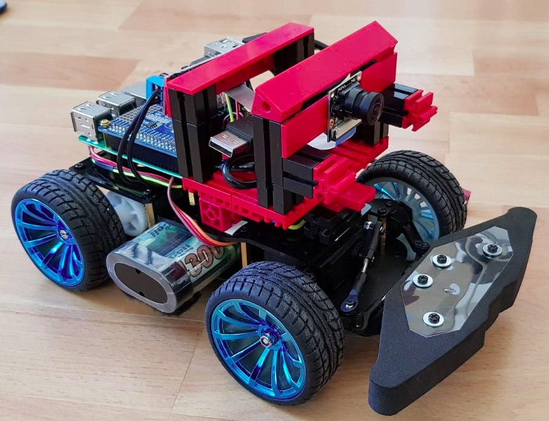

# Tips and Tricks

This is a set of documents and instructions to build and tune up you autonomous driving cars.
Following guids are provided

* [Using the Jetson Nano Board with Donkey Car](jetson_nano.md)
* [Build Instructions for the Indoor Compact Racer](indoor_compact_car.md)

