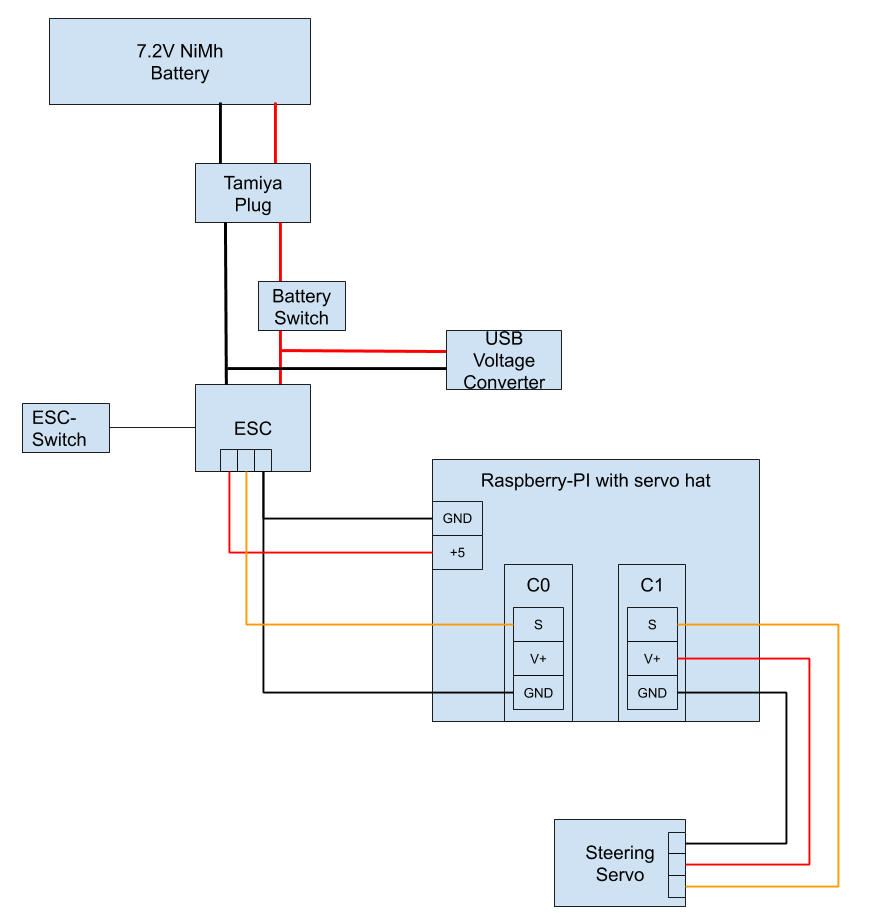

# Compact Donkey Car

This guide presents the hardware setup of a compact donkey car for indoor testing. It is designed for getting to know the donkey car platform and is meant for beginners. It was designed with following intentions:

* no surprises, it just works out of the box with donkey car
* simple wiring and mechanics
* precise controls of actuators
* cheap, but build with parts of decent quality
* small form factor and low speed for indoor testing
* safety: no fire hazard with lipo batteries

## Vehicle Chassis - 4WD RC Smart Auto Chassis for Arduino

The 4WD RC Smart Chassis is a good choice, since it offers a very precise steering and a planetary drive motor setup.
By this, the vehicle can be controlled up to a precision of 0,5 cm.
The planetary drive with a transmission of 1:20 allows conducting very smooth acceleration evens.
However, it limits the speed to ~15km/h, which is totally fine for indoor usage

Available from following dealers:

* [Amazon Germany](https://www.amazon.de/RoboMall-4WD-Smart-Car-Chassis/dp/B075MDVHFJ/)
* [Ali Express](https://de.aliexpress.com/item/32830665408.html)

If you are looking for a faster alternative with similar dimensions and steering precision, checkout the alternative from from [Seeedstudion](https://www.seeedstudio.com/Robot-car-Kit-RC-Smart-Car-Chassis-p-4226.html)

## Kinematics

### Steering Servo

The steering servo is part of the vehicle chassis kit presented above.

### Electronic Speed Controller (ESC)

The electronic speed controller is used to control the electric motor from the Servo Hat attached to the Raspberry PI.

The _Hobbywing QuicRun 1625 25A Brushed ESC Speed Controller For 1:10 /1:18 1:16 Car_ is an excellent choice, since it provides:

* very accurate power control
* 5 Volt output (BEC) to power the Servo Hat and the attached servo
* full compatibility with the Raspberry PI Servo hat and its PWM resolution
* automatic neutral position adjustment, which is very handy when the car is calibrated initially in Donkey Car
* support for NiMhd batteries
* a power switch to immobilize the vehicle while working the Raspberry PI

### Actuator Controlling

For controlling the actuators (servo and ESC) accurately I recommend a PWM-chip with a resolution of 12 bit. The 12 bit resolution allows a wide set of servo angles and a very precise control of the ESCs. For generating PWM signals a _PCA9685_ chip is used. There are many vendors of _PCA9685_ boards that can be attached to the RaspberryPI. Howevery, I recommend using a _Servo Hat_ from _adafruit_ that features a very good design and is very stable on powering servos. The _Servo Hat_ is available at [Reichelt](https://www.reichelt.de/raspberry-pi-servo-hat-16-kanal-pwm-pca9685-rpi-servo-hat-p235533.html?&trstct=pos_0).

When soldering the pins the PCB, only solder the connection main sockets on the top, the blue power connector and the first PWM channel block from channel 0 to 3. The other blocks 4 to 15 are not needed. Do not solder them Keep the spare pins, since we need them to build the wire harness lateron.

## Compute Platform

### Raspberry PI 3B+

A classic Raspberry PI 3B+ is used as compute platform.
In Germany, you can buy it at [Reichelt](https://www.reichelt.de/raspberry-pi-3-b-4x-1-4-ghz-1-gb-ram-wlan-bt-raspberry-pi-3b-p217696.html).

## Battery and Power

### USB Power

The Raspberry PI is powered from the main battery of the vehicle. To bring the 8 Volt down to the USB 5V voltage a step down converter is needed. For this, a DEBO DC 2XUSB converter is used. It can be bought at [Reichelt](https://www.reichelt.de/entwicklerboards-spannungsregler-6-40-v-dc-auf-2x-usb-5v-3a-debo-dc-2xusb-p242778.html?&trstct=pos_9).

### Main Battery

As main battery, a 7.2Volt NiMh battery is used with a capacity of 4300 mAh. This allows to run the car about 30 minutes in autonomous mode. You can can get the battery at [Reichelt](https://www.reichelt.com/gb/de/akku-pack-nimh-7-2-v-4300-mah-6-zellen-tamiya-xr6-4300-p85268.html?&trstct=pol_2)

### USB-Y-Cable & power

You may encounter situations, where you need to unplug the main battery, e.g. for charging, while you want your RaspberryPi continue to run. In this situation, you need to bridge the USB-power for the RaspberryPi, while the main battery is offline. The trick to achieve this is to use a USB-Y-Cable that powers the RaspberryPi from a USB power bank, while the main battery is offline and cannot provide power through the 5V-voltage converter.

## Cables and Plugs

To finish the vehicle, you need some cables and plugs:

* [some jumper cables](https://www.reichelt.com/gb/en/gb/de/20-pole-jumper-cable-m-m-f-f-f-m-25-cm-debo-kabelset-p161046.html?GROUPID=8244&START=0&OFFSET=16&SID=95XZT1TqwQATYAACNM8dMd6a825e01c051ded2d9a6299196e3b89&&r=1) to interconnect the ESC with the RaspberryPi
* [Tamiya battery coupling](https://www.reichelt.de/tamiya-coupling-for-power-pack-tam-bu-p28047.html?r=1) to access the main battery
* [two 3.4mm bullet connectors](https://hobbyking.com/en_us/polymax-3-5mm-gold-connectors-10-pairs-20pc.html) to connect the ESC to the motor
* [heat shrink tube set](https://www.reichelt.de/heat-shrink-tube-set-50-pieces-assorted-colours-delock-86279-p167392.html?GROUPID=7812&START=0&OFFSET=16&SID=95XZT1TqwQATYAACNM8dMd6a825e01c051ded2d9a6299196e3b89&LANGUAGE=EN&&r=1) for isolation
* [High quality silicon covered cables](https://hobbyking.com/en_us/turnigy-high-quality-18awg-silicone-wire-1m-black.html) for building the power distribution.

## Wiring

For the wiring, we extend the wires of the ESC to power the servo from the ESC BEC (Battery Eliminator Circuit) directly.
Here is the complete wiring diagram:

