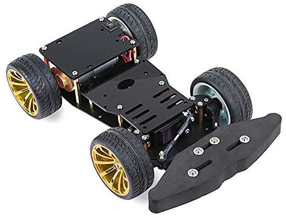
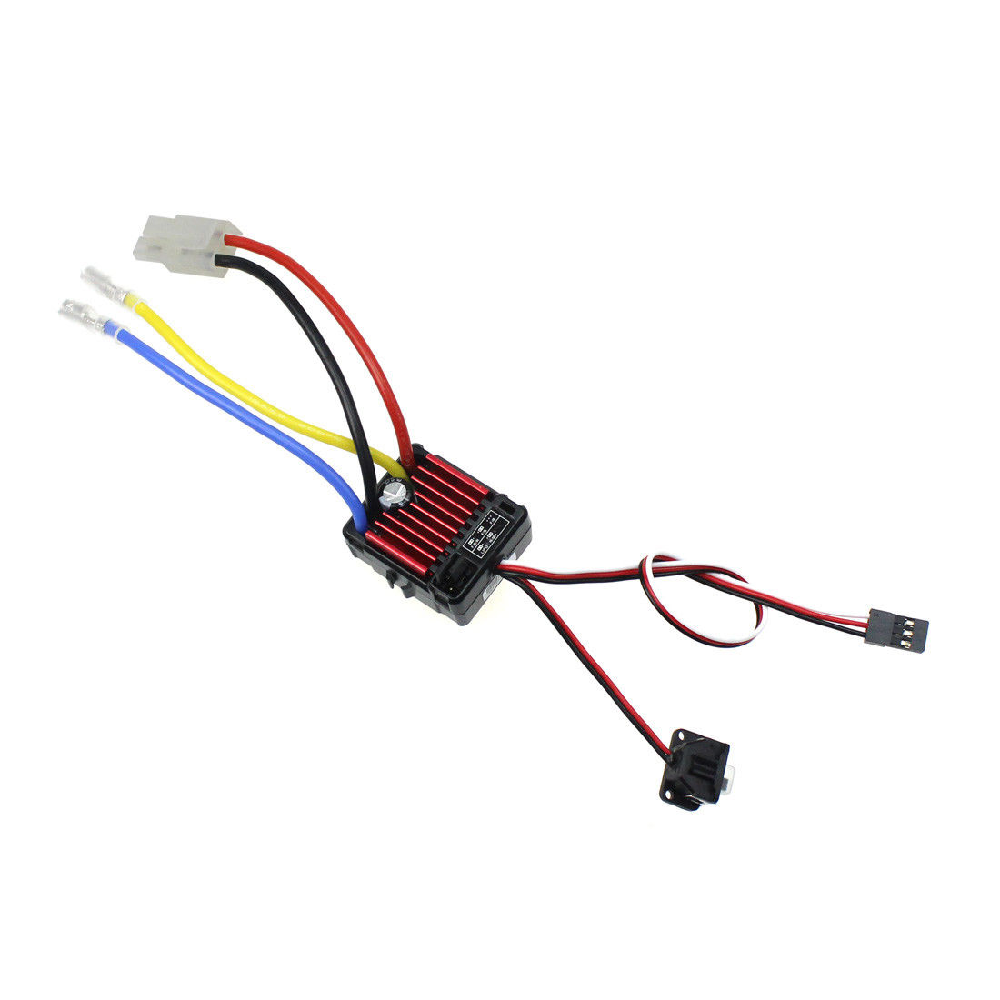
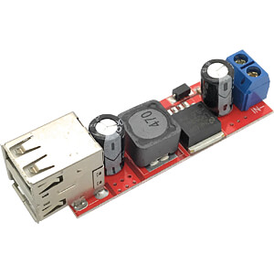
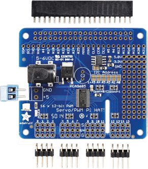

# Compact Donkey Car

THIS IS WORK IN PROGRESS

## Vehicle Chassis - 4WD RC Smart Auto Chassis for Arduino

The 4WD RC Smart Chassis is a good choice, since it offers a very precise steering and a planetary drive motor setup.
By this, the vehicle can be controlled up to a precision of 0,5 cm.
The planetary drive with a transmission of 1:20 allows conducting very smooth acceleration evens.
However, it limits the speed to ~15km/h, which is totally fine for indoor usage

Available from following dealers:

* [Amazon Germany](https://www.amazon.de/RoboMall-4WD-Smart-Car-Chassis/dp/B075MDVHFJ/)
* [Ali Express](https://de.aliexpress.com/item/32830665408.html)

If you are looking for a faster alternative with similar dimensions and steering precision, checkout the alternative from from [Seeedstudion](https://www.seeedstudio.com/Robot-car-Kit-RC-Smart-Car-Chassis-p-4226.html)

## Kinematics

### Steering Servo

The steering servo is part of the vehicle chassis kit presented above.

### Electronic Speed Controller (ESC)

The electronic speed controller is used to control the electric motor from the Servo Hat attached to the Raspberry PI.

The _Hobbywing QuicRun 1625 25A Brushed ESC Speed Controller For 1:10 /1:18 1:16 Car_ is an excellent choice, since it provides:

* very accurate power control
* 5 Volt output (BEC) to power the Servo Hat and the attached servo
* full compatibility with the Raspberry PI Servo hat and its PWM resolution
* automatic neutral position adjustment, which is very handy when the car is calibrated initially in Donkey Car
* support for NiMhd batteries
* a power switch to immobilize the vehicle while working the Raspberry PI

## Compute Platform

### Raspberry PI 3B+

A classic Raspberry PI 3B+ is used as compute platform.
In Germany, you can buy it at [Reichelt](https://www.reichelt.de/raspberry-pi-3-b-4x-1-4-ghz-1-gb-ram-wlan-bt-raspberry-pi-3b-p217696.html).

### USB Power

The Raspberry PI is powered from the main battery of the vehicle. To bring the 8 Volt down to the USB 5V voltage a step down converter is needed. For this, a DEBO DC 2XUSB converter is used. It can be bought at [Reichelt](https://www.reichelt.de/entwicklerboards-spannungsregler-6-40-v-dc-auf-2x-usb-5v-3a-debo-dc-2xusb-p242778.html?&trstct=pos_9).

### Actuator Controlling

For controlling the actuators (servo and ESC) accurately I recommend a PWM-chip with a resolution of 12 bit. The 12 bit resolution allows a wide set of servo angles and a very precise control of the ESCs. For generating PWM signals a _PCA9685_ chip is used. There are many vendors of _PCA9685_ boards that can be attached to the RaspberryPI. Howevery, I recommend using a _Servo Hat_ from _adafruit_ that features a very good design and is very stable on powering servos. The _Servo Hat_ is available at [Reichelt](https://www.reichelt.de/raspberry-pi-servo-hat-16-kanal-pwm-pca9685-rpi-servo-hat-p235533.html?&trstct=pos_0).

## Assembly

## Cabling

## Calibration